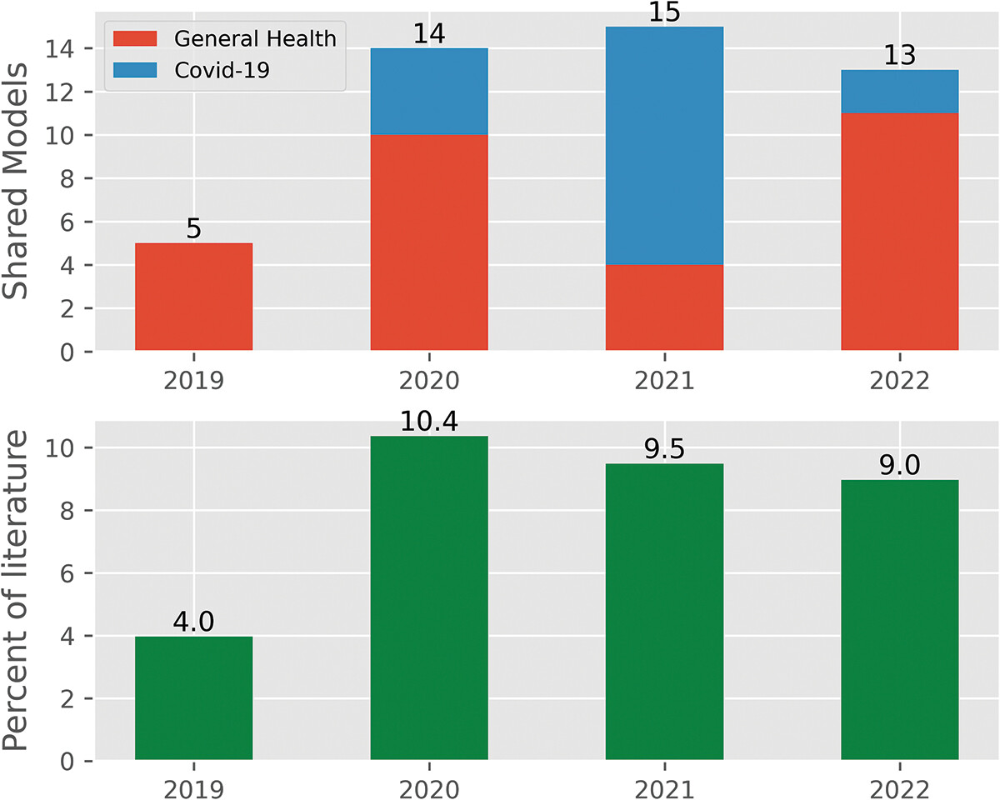

## Summary

Our focus in this study is on the practice of sharing healthcare DES computer models: to what extent do health researchers openly share their DES computer models, how do they do it, and what actions could the DES community take to improve what is shared?

### Model sharing

In total, 47 (8.3%) of the included 564 studies cited an openly available DES computer model that was used to generate their results. Of these 47, the majority (n = 29) of models were developed using FOSS tools

The proportion of the literature that cited an openly available DES computer model increased from 4.0% in 2019 to 9.0% in 2022; the years 2020–2022 were similar in proportion. The figure below illustrates this, with models split by year and whether they focused on COVID-19.

{width=80% fig-align="center"}

### Model audit

The table shows the results or out audit, split by code and VIM-based models. VIM are Visual Interactive Modelling software (VIM; e.g., Arena, Anylogic, or Simio).

| Practice | CODE (%) | VIM (%) |
| - | - | - |
| Model has DOI	| 4 (12.9) | 3 (18.8) |
| ORCID | 3 (9.7) | 3 (18.8) |
| Licensed | 15 (48.4) | 6 (37.5) |
| Readme | 21 (67.7) | 7 (43.8) |
| Steps to run | 13 (41.9) | 3 (18.8) |
| Formal Dep Mgt | 7 (22.6) | n/a |
| Informal Dep Mgt | 7 (22.6) | 8 (50.0) |
| Evidence of testing | 3 (9.7) | n/a |
| Model downloadable | 31 (100.0) | 11 (68.8) |
| Model interactive online | 4 (12.9) | 6 (37.5) |

## Online supplementary appendix

We created a Jupyter Book to serve as an online supplementary appendix, providing greater detail on the review results. This can be viewed at <https://tommonks.github.io/des_sharing_lit_review>. The codebase behind this website is open and available at <https://github.com/TomMonks/des_sharing_lit_review>.

```{=html}
<div class="iframe-wrapper">
  <div class="iframe-header">
    <span>Website preview:</span>
    <a href="https://tommonks.github.io/des_sharing_lit_review"
       target="_blank" rel="noopener">
      View full website in new tab
    </a>
  </div>

  <iframe
    width="100%"
    height="500"
    src="https://tommonks.github.io/des_sharing_lit_review"
    title="Model and code sharing practices in healthcare discrete-event simulation - a systematic review">
  </iframe>
</div>
<br>
```

## Zotero

We created a Zotero online database with studies that shared computer simulation models: <https://www.zotero.org/groups/4877863/des_papers_with_code/library>.

## Subsequent work

Following on from this review, we developed the [STARS framework for model reuse](/pages/research/stars_framework_reuse.qmd), which provides practical guidance to help improve the reusability of shared healthcare DES models.

## Publication

::: {#pub}
:::