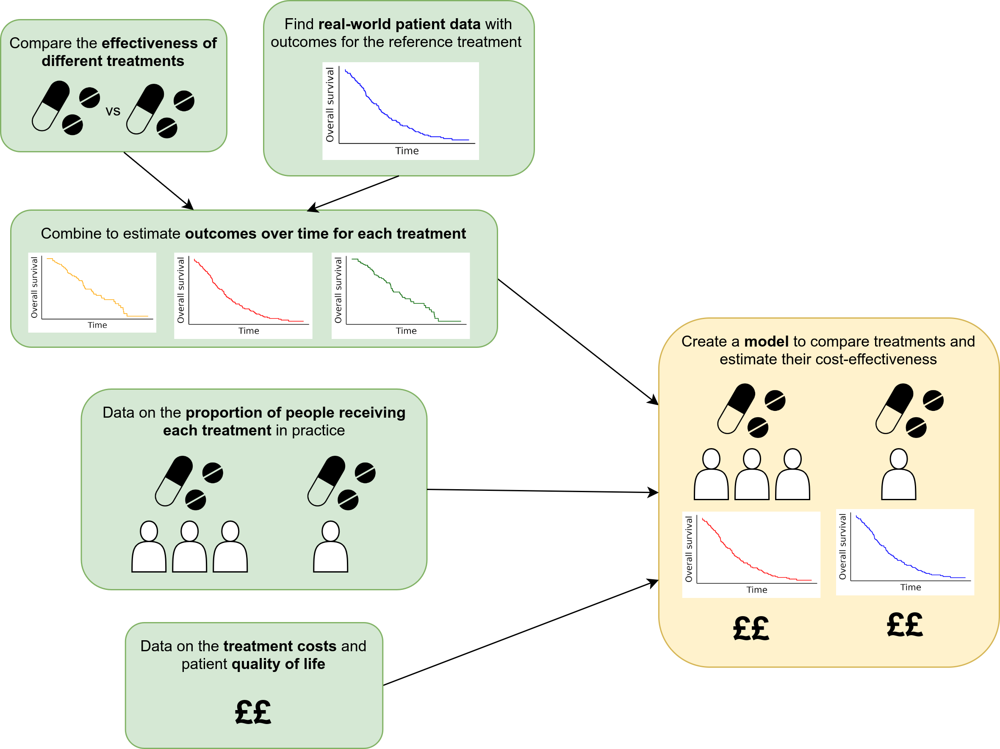
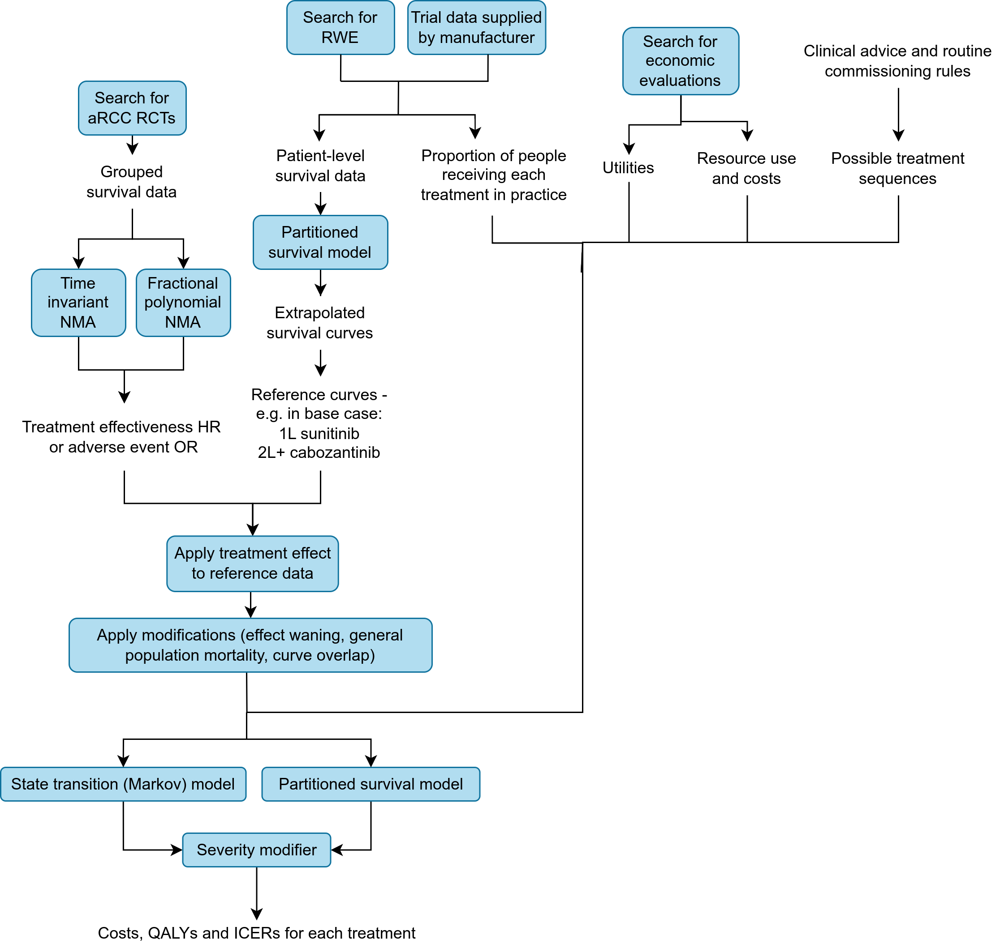

## Context

The **Exeter Oncology Model: Renal Cell Carcinoma edition (EOM-RCC)** is a platform cost-effectiveness model encompassing each decision node in the disease area for advanced renal cell carcinoma.

It was constructed as part of two National Institute for Health and Care Excellence (NICE) appraisals:

* The NICE Pathways Pilot appraisal (ID6186, [GID-TA11186](https://www.nice.org.uk/guidance/indevelopment/gid-ta11186)).
* The NICE appraisal of cabozantinib plus nivolumab ([TA964](https://www.nice.org.uk/guidance/ta964)) (formerly ID6184, whilst in development). 

The model was developed by the Peninsula Technology Assessment Group (PenTAG) and collaborators. It's development is briefly described in:

> Lee D, Burns D, Wilson E. NICE’s Pathways Pilot: Pursuing Good Decision Making in Difficult Circumstances. PharmacoEconomics - Open 2024. <https://doi.org/10.1007/s41669-024-00490-x>.

The model is available on GitHub:

> Lee D., Muthukumar M., Lovell A., Farmer C., Burns D., Matthews J., Coelho H., O'Toole B., Trigg L., Snowsill T., Barnish M., Nikoglou T., Brand A., Ahmad Z., Abdelsabour A., Robinson S., Heather A., Wilson E., Melendez-Torres G. Exeter Oncology Model: RCC edition URL: <https://github.com/nice-digital/NICE-model-repo>.

## Improving the reusability of EOM-RCC

Our involvement in EOM-RCC as part of the STARS project has been to help improve the reusability of the model, including helping it adhere to the [STARS framework for model reuse](/pages/research/stars_framework_reuse.qmd).

Below, we have linked to our forked versions of the GitHub repositories with these changes, but they have also been integrated into the NICE model repository linked above.

### GitHub repository

We can compare the repository [before](https://github.com/pythonhealthdatascience/stars-eom-rcc/tree/8e2bb675c86e86e9d1318094a880f17682d86fa4) and [after](https://github.com/pythonhealthdatascience/stars-eom-rcc) our changes, to see that amendments included that we:

* Add dependency management (using `renv`).
* Add model documentation and web app (as described below).
* Add `CHANGELOG.md` and `CITATION.cff`
* Amended `README.md` to incorporate information from the word document (which had instructions on how to run the model) - as well adding things like badges, ORCID IDs, repository overview, citation instructions, and funding.
* Created releases and archived the repository on Zenodo.

### Model documentation

We developed a website with detailed model documentation which you can view at <https://pythonhealthdatascience.github.io/stars-eom-rcc/> (code available [on GitHub](https://github.com/pythonhealthdatascience/stars-eom-rcc/tree/main/docs)). It provides:

* Acronyms.
* Context on the associated NICE appraisals, articles and reports.
* A detailed summary of the analysis.
* A plain english summary of the analysis.
* Installation instructions.
* A step-by-step walkthrough of the code in `Model_Structure.R`.
* Descriptions of the probabilistic analysis and scenario analysis.
* Details about the license, citation instructions and the changelog.

```{=html}
<div class="iframe-wrapper">
  <div class="iframe-header">
    <span>Documentation website preview:</span>
    <a href="https://pythonhealthdatascience.github.io/stars-eom-rcc/"
       target="_blank" rel="noopener">
      View full website in new tab
    </a>
  </div>

  <iframe
    width="100%"
    height="500"
    src="https://pythonhealthdatascience.github.io/stars-eom-rcc/"
    title="EOM:RCC web app">
  </iframe>
</div>
<br>
```

For example, a diagram from our [plain english summary](https://pythonhealthdatascience.github.io/stars-eom-rcc/pages/plain_english.html) of the analysis:

{width=80% fig-align="center"}

Conversely, a diagram from the [detailed summary](https://pythonhealthdatascience.github.io/stars-eom-rcc/pages/model_overview.html):

{width=80% fig-align="center"}

### Web application

The ambition for EOM:RCC is to create a shiny interface that allows users to interact and run the full economic model from a web application. We created pilot example web app has been created which allows users to run one part of the analysis: creating a table of possible treatment sequences.

The app was developed using RShiny, with code available at <https://github.com/pythonhealthdatascience/stars-eom-rcc/tree/main/shinyapp>. The app is hosted using shinyapps at <https://amyheather.shinyapps.io/shinyapp/>.

```{=html}
<div class="iframe-wrapper">
  <div class="iframe-header">
    <span>Web app preview:</span>
    <a href="https://amyheather.shinyapps.io/shinyapp/"
       target="_blank" rel="noopener">
      View full app in new tab
    </a>
  </div>

  <iframe
    width="100%"
    height="500"
    src="https://amyheather.shinyapps.io/shinyapp/"
    title="EOM:RCC web app">
  </iframe>
</div>
<br>
```

## Feedback

::: {.card-blue}

**Feedback from Dawn Lee (PenTAG):** "What you've done looks fantastic and should really help us demonstrate the potential for our bid. Wanted to say a massive thank you for all your hard work on this!"

:::

<br>
---

*This page was written by Amy Heather and reflects her interpretation of this work, which may not fully represent the views of all project authors or affiliated institutions.*