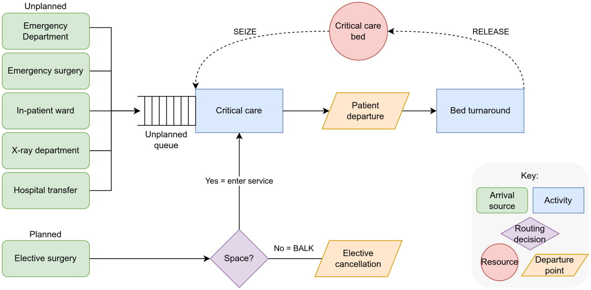
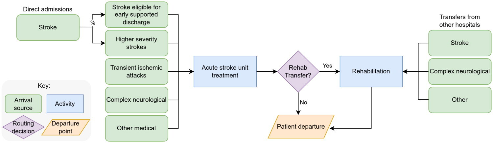
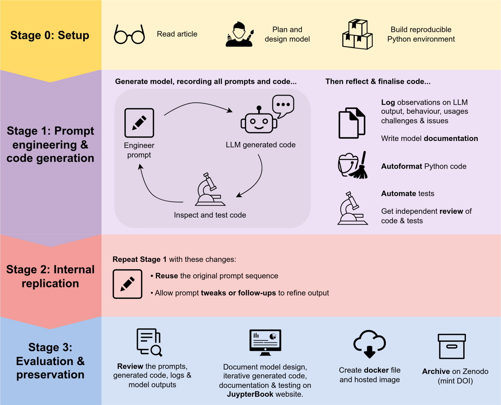

We investigated whether published DES models can be replicated using generative AI / large language models (LLMs). If they can be used to replicate models, then it may be a useful approach to reusing research where the code has not been made available.

There have been some prior studies attempting to generate DES models, but these had focused on very simple examples (e.g., 20 to 30 lines of code).

In our research, we attempted to replicate two healthcare studies:

1. **Critical care unit model** - A model developed in VBA, never published online to our knowledge. Model diagram:



2. **Stroke pathway capacity planning model** - A model developed in Simul8, never published online.



We followed a very structured approach with careful prompt engineering and testing, as summarised in this figure:



We successfully generated, tested and internally reproduced two DES models, including user interfaces.

The reported results were replicated for one model, but not the other, likely due to missing information on distributions.

Given the challenges we faced in prompt engineering, code generation, and model testing, we conclude that our iterative approach to model development, systematic comparison and testing, and the expertise of our team were necessary to the success of our recreated simulation models.

## Summary website

We created a comprehensive website using JupyterBook showing every step of our replications.

* [Website](https://pythonhealthdatascience.github.io/llm_simpy/)
* [GitHub for the website](https://github.com/pythonhealthdatascience/llm_simpy)

```{=html}
<div class="iframe-wrapper">
  <div class="iframe-header">
    <span>Website preview:</span>
    <a href="https://pythonhealthdatascience.github.io/llm_simpy"
       target="_blank" rel="noopener">
      View website in new tab
    </a>
  </div>

  <iframe
    width="100%"
    height="500"
    src="https://pythonhealthdatascience.github.io/llm_simpy/"
    title="Research Compendium: Replicating Simulations in Python using Generative AI">
  </iframe>
</div>
<br>
```

## User interfaces

We have deployed the AI-generated user interfaces as a web app on GitHub pages using `stlite`. This allows the app to run directly in a user's web browser without requiring any manual installations. It achieves this by using WebAssembly technology to run a serverless version of `streamlit` (i.e. `stlite`). The entire app, along with all its dependencies, are downloaded and installed within the browser at runtime using `pyodide` and `micropip`. There will be a short wait while the app is setup. Once the setup is complete, the app runs locally in the browser, meaning that no user data leaves the local machine. **Please note that `stlite` does not currently work in Mozilla Firefox**. Relevant links:

* [Web apps](https://pythonhealthdatascience.github.io/llm_simpy_models/)
* [GitHub for deployed web apps](https://github.com/pythonhealthdatascience/llm_simpy_models)

```{=html}
<div class="iframe-wrapper">
  <div class="iframe-header">
    <span>Web app preview:</span>
    <a href="https://pythonhealthdatascience.github.io/llm_simpy_models/"
       target="_blank" rel="noopener">
      View web apps in new tab
    </a>
  </div>

  <iframe
    width="100%"
    height="500"
    src="https://pythonhealthdatascience.github.io/llm_simpy_models/"
    title="Complementary repository: Final discrete-event simulation models and streamlit applications from Large Language Models">
  </iframe>
</div>
<br>
```

## Publication

::: {#pub}
:::

<br>
---

*This page was written by Amy Heather and reflects her interpretation of this work, which may not fully represent the views of all project authors or affiliated institutions.*