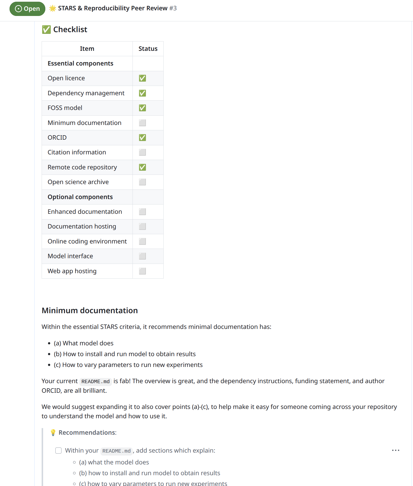

We have supported some existing modellers to make their DES more reproducible and reusable.

## Devon Air Ambulance Discrete Event Simulation

In progress - watch this space!
<!--TODO-->

## Hybrid Simulation Modelling for Orthopaedics

The model is available at:

> Matthew Howells , Paul Harper , Daniel Gartner , Geraint Palmer  (2025) Hybrid Simulation Modelling for Orthopaedics. GitHub. <https://github.com/MHowells/HybridSimModel>.

It combines:

* A system dynamics model used to model patient deterioration while waiting for a GP referral to primary care.
* A DES model used to model the patient journey through an orthopaedic department.

It is summarised in the poster "[Clinical Pathway Modelling of a Trauma and Orthopaedics Department](https://github.com/MHowells/SW25_poster)" from the OR Society's 12th Simulation Workshop (SW25) conference

Our involvement was to complete a review of the model repository, providing the review as a [GitHub issue](https://github.com/MHowells/HybridSimModel/issues/3) (and an accompanying [pull request](https://github.com/MHowells/HybridSimModel/pull/2)). The review was structured into:

* A review summary.
* Feedback from running the code (e.g., dependency management, code troubleshooting).
* Evaluation against the STARS framework for model reuse.
* Evaluation against the STARS reproducibility recommendations.

For example, a snapshot from the review:

 
---

*This page was written by Amy Heather and reflects her interpretation of this work, which may not fully represent the views of all project authors or affiliated institutions.*