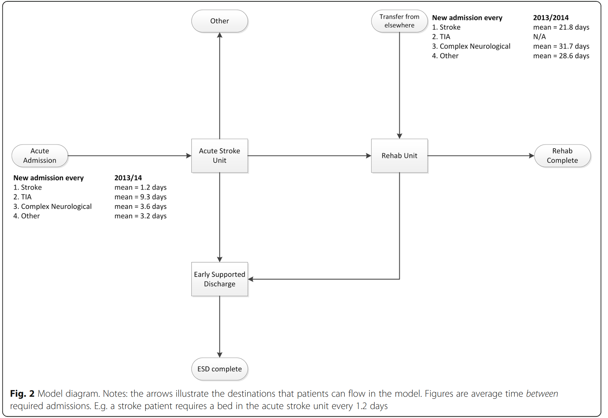

## Background

Tom Monks is the Principal Investigator on STARS. His interest in open and reproducible simulation research began with an unsuccessful attempt to share a model with the NHS in England.

## The original model

A few years ago, Tom was part of a team that developed a discrete-event simulation model of stroke care in England using **Simul8**, a commercial simulation platform.

To support replication, the team published full details of the model design, parameters, assumptions, and system flow in the following paper:

> Monks T, Worthington D, Allen M, Pitt M, Stein K, James MA. A modelling tool for capacity planning in acute and community stroke services. BMC Health Serv Res. 2016 Sep 29;16(1):530. doi: [10.1186/s12913-016-1789-4](https://doi.org/10.1186/s12913-016-1789-4). PMID: 27688152; PMCID: PMC5043535.

{width=80%}

## A request for reuse

After publication, an NHS organisation covering two large cities in England asked to reuse the model to help redesign and evaluate their stroke service.

The research team was happy to share the Simul8 model, Excel interface, and usage instructions. However, several barriers soon became clear:

::: {.callout-important title="Problem 1"}

The NHS organisation did not have budget for the commercial simulation software.

:::

::: {.callout-important title="Problem 2"}

The Simul8 licence held by the research team did not allow sharing the model via the cloud.

:::

::: {.callout-important title="Problem 3"}

The NHS could have commissioned the research team to carry out the work, but that would have cost even more.

:::

## Lessons learned

In the end, the model could not be reused. This experience raised an important question:

> **Can others actually use the models and materials we publish?**

It showed that even detailed reporting is not enough if reuse depends on restricted tools or resources.

## What came next?

This experience helped shape later research into reproducibility and reuse in simulation.  

The team has since developed **open-source versions** of the stroke model in **Python** and **R**, freely available for others to use and adapt.

<a class="research-btn" href="https://github.com/pythonhealthdatascience/pydesrap_stroke">
  ➤ &nbsp;&nbsp; View Python version of the stroke model
</a>

<a class="research-btn" href="https://github.com/pythonhealthdatascience/rdesrap_stroke">
  ➤ &nbsp;&nbsp; View R version of the stroke model
</a>
