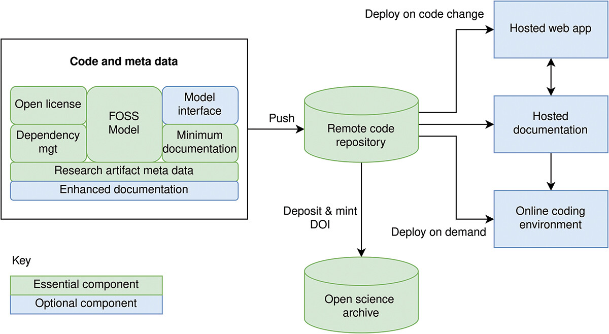

## STARS framework

We designed the STARS framework to support researchers in making the healthcare DES models more **reusable**. It is dividing into essential and optional components.

Essential  components provide the minimum work needed to share DES models to allow them to be available long-term, citable, functional, appropriately licenced, and likely to be at a standard that is reusable in further work.

Optional components focus on enhancing the accessibility, understanding, and maintainability of FOSS simulation models.

| Item | Description |
| - | - |
| **Essential components** |
| Open licence | Free and open-source software (FOSS) licence (e.g. MIT, GNU Public Licence (GPL)) |
| Dependency management | Specify software libraries, version numbers and sources (e.g. dependency management tools like virtualenv, conda, poetry) |
| FOSS model | Coded in FOSS language (e.g. R, Julia, Python) |
| Minimum documentation | Minimal instructions (e.g. in README) that overview (a) what model does, (b) how to install and run model to obtain results, and (c) how to vary parameters to run new experiments |
| ORCID | ORCID for each study author |
| Citation information | Instructions on how to cite the research artefact (e.g. CITATION.cff file) |
| Remote code repository | Code available in a remote code repository (e.g. GitHub, GitLab, BitBucket) |
| Open science archive | Code stored in an open science archive with FORCE11 compliant citation and guaranteed persistance of digital artefacts (e.g. Figshare, Zenodo, the Open Science Framework (OSF), and the Computational Modeling in the Social and Ecological Sciences Network (CoMSES Net)) |
| **Optional components** |
| Enhanced documentation | Open and high quality documentation on how the model is implemented and works  (e.g. via notebooks and markdown files, brought together using software like Quarto and Jupyter Book). Suggested content includes: • Plain english summary of project and model • Clarifying licence • Citation instructions • Contribution instructions • Model installation instructions • Structured code walk through of model • Documentation of modelling cycle using TRACE • Annotated simulation reporting guidelines • Clear description of model validation including its intended purpose |
| Documentation hosting | Host documentation (e.g. with GitHub pages, GitLab pages, BitBucket Cloud, Quarto Pub) |
| Online coding environment | Provide an online environment where users can run and change code (e.g. BinderHub, Google Colaboratory, Deepnote) |
| Model interface | Provide web application interface to the model so it is accessible to less technical simulation users |
| Web app hosting | Host web app online (e.g. Streamlit Community Cloud, ShinyApps hosting) |
: {tbl-colwidths="[30, 70]"}

## Implementation of the framework across the three examples

| STARS Components | Item | Applied example 1 | Applied example 2 | Applied example 3 |
| :-- | :-- | :-- | :-- | :-- |
| Essential | Open Licence | MIT | MIT | GNU Public Licence 3 |
| Essential | Dependency mgt | conda | conda | conda |
| Essential | DES software | simpy | simpy | ciw |
| Essential | Code repository | GitHub | GitHub | GitHub |
| Essential | Meta-data | citation.cff + ORCID | citation.cff + ORCID | citation.cff + ORCID |
| Essential | Minimum documentation | README.md | README.md | README.md |
| Essential | Open science repository | Zenodo | Zenodo | Zenodo |
| Optional | Online coding environment | Binder | Binder | Binder |
| Optional | Enhanced documentation | Electronic Notebook | Jupyter Book + STRESS | Quarto + STRESS |
| Optional | Documentation hosting |  | GitHub pages | GitHub pages |
| Optional | Model interface |  | streamlit | Shiny for python |
| Optional | Web app hosting |  | streamlit community cloud | shinyapps.io |

## Example 1

**Code repository:** <https://github.com/pythonhealthdatascience/stars-treat-sim>

**DOI:** <https://doi.org/10.5281/zenodo.10026327>

## Example 2

**Code repository (app):** <https://github.com/pythonhealthdatascience/stars-streamlit-example>

**Code repository (documentation):** <https://github.com/pythonhealthdatascience/stars-simpy-example-docs>

**Web app:** <https://stars-simpy-example.streamlit.app/>

**Documentation:** <https://pythonhealthdatascience.github.io/stars-simpy-example-docs>

**DOIs:** <https://doi.org/10.5281/zenodo.10055169> and <https://doi.org/10.5281/zenodo.10054063>

## Example 3

**Code repository:** <https://github.com/pythonhealthdatascience/stars-ciw-example>

**Web app:** <https://pythonhealthdatascience.shinyapps.io/stars-ciw-examplar>

**Documentation:** <https://pythonhealthdatascience.github.io/stars-ciw-example>

**DOI:** <https://doi.org/10.5281/zenodo.10051495>

## Publication

::: {#pub}
:::

 
---

*This page was written by Amy Heather and reflects her interpretation of this work, which may not fully represent the views of all project authors or affiliated institutions.*